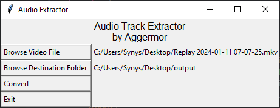

# Audio Track Extractor by Aggermor
I created this tool to more easily extract several audio tracks from one video file and convert them into separate audio files.

***My use case:** using OBS to record multiple audio tracks like System, Mic, Discord, Music into one file this tool can seperate each track into it's own file.*

## How to Use
1. Run the script.
2. Click on "Browse Video File" to select the video file.
3. Click on "Browse Destination Folder" to select the output directory.
4. Click on "Convert" to start the extraction process.

## Dependencies
-  **Python 3**
    - `os.path.join`: This function is used to combine one or more path names into a single path.
    - `os.path.exists`: This function is used to check if a path exists.
    - ``subprocess.run``: This function is used to run the command with arguments and wait for the command to complete.

- **ffmpeg**
    > ffmpeg is a universal media converter. It can read a wide variety of inputs, filter, and transcode them into a plethora of output formats. ffmpeg can be used for various video processing tasks such as denoising, blurring, color conversion, rotation, extraction of frames, letter-boxing, etc. 
    
    In this code, ffmpeg is used to extract each audio track from the video file and save it as a separate .mp3 file.

    - `ffmpeg -y -i <video_file> -map 0:a:<i> <output_file>`: This command is used to extract the i-th audio stream from the video file and save it as an output file.

- **ffprobe**
    >  ffprobe is a tool from the FFmpeg suite that gathers information from multimedia streams and prints it in human- and machine-readable fashion. It can be used to check the format of the container used by a multimedia stream and the format and type of each media stream contained in it. 
    
    In this code, ffprobe is used to determine the number of audio tracks in a video file.

    - `ffprobe -v error -select_streams a -show_entries stream=index -of csv=p=0 <video_file>`: This command is used to get the number of audio streams in a video file.

- **tkinter** 
    > tkinter is the standard Python interface to the Tk GUI toolkit. It allows developers to create windows, buttons, menus, and other GUI components to build interactive and user-friendly applications. 
    
    In this code, tkinter is used to create the graphical user interface, including the file and directory selection dialogs and the “Convert” button.

    - `tkinter.Tk`: This class is used to create a top-level widget of Tk which usually is the main window of an application.
    - `tkinter.StringVar`: This class is used to create a tkinter variable, specifically a string variable.
    - `tkinter.Label, tkinter.Button`: These classes are used to create label and button widgets.
    - `tkinter.filedialog.askopenfilename, tkinter.filedialog.askdirectory`: These functions are used to open a file dialog and directory dialog respectively.
    - `tkinter.messagebox.showinfo, tkinter.messagebox.askyesnocancel, tkinter.messagebox.askyesno`: These functions are used to display different types of message boxes.

## License
This project is licensed under the MIT License - see the LICENSE.md file for details
